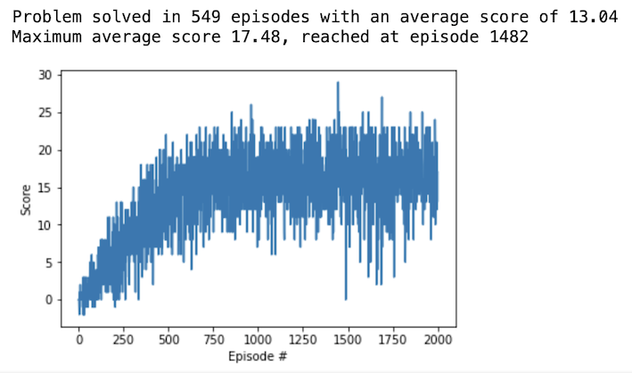

# Technical report on Project 1: Navigation

## Introduction

This report introduces the details about how the smart agent has been designed and trained so that it can solve the task posed by the NAVIGATION project, namely: to navigate in the Banana Collector environment in order to pick up as much as possible yellow bananas and avoid the blue ones in every episode.

## Learning algorithm
The smart agent is taught to optimally navigate following a Deep Reinforcement Learning approach.

Whereas Reinforcement Learning is a computational framework that addresses the problem of teaching an agent to select actions in a certain environment, with which it interacts, Deep Reinforcement Learning can deal with the same problem in unknown, dynamic, complex and even stochastic environments. And this is the case of the Banana Collector environment: it is a continuous space that the agent observes through a large number of sensory inputs (37) and on which it has no prior knowledge. 

The smart agent is designed on the top of the popular Deep Q-network algorithm (DQN), which was first introduced in 2015 in [this paper](http://files.davidqiu.com//research/nature14236.pdf). It is a value-based algorithm that allows the agent to map states to actions by means of estimating the action-value function and then selecting the action that maximizes the value of that function for a specific state (Q-learning method). Value for an action-state couple must be understood as the sum of the expected reward that the agent will get at the end of an episode, if it chooses that action when at that state and then keep on following using the current policy for the following states.

The final implementation of the smart agent algorithm integrates the following improvements to the vanilla DQN algorithm: experience replay and fixed Q targets with soft update.

The smart agent is codified in Python-PyTorch code in the file `dqn_agent.py`.

## Architecture of the neural network used as function approximator
At the heart of the DQN algorithm there is a deep neural network that acts as a function approximator of the action-value function. The environment state is passed in and the function approximator produces a vector of action values, with the max value indicating the action to take (Q-learning method).

That function approximator is represented by a feedforward multilayer perceptron (MLP) neural network with the following features:
+ input layer: 37 nodes (one for every dimension of the state vector)
+ two hidden layers with 64 nodes each (read later about how the number of nodes were chosen) and a ReLu activation function applied at the output of each layer
+ output layer: 4 nodes (one for every dimension of the action space)

The architecture of the action-value function approximator is codified in Python-PyTorch code in the file `funct_appr_model.py`.

## Chosen Hyperparameters
The final values of the hyperparameters considered are listed next.
+ Function approximator architecture:
  + Nodes at hidden layer1 --> fc1 = 64
  + Nodes at hidden layer2 --> fc2 = 64

+ Learning process
  + Replay buffer size = 100000
  + Minibatch size = 64
  + Discount factor (gamma) = 0.99
  + Learning rate (lr) = 0.0001
  + Maximum episodes = 2000
  + Maximum time-steps per episode = 300

+ Greedy policy:
  + Epsilon start = 1.0
  + Epsilon decay = 0.995
  + Epsilon end = 0.01

+ Fixed Q-targets:
  + Update rate of network weights --> every 4 episodes
  + Soft network parameter (tau) = 0.001

A number of sensitivity analyses were carried out in the following hyperparameters before freezing their final values:
+ Maximum time-steps per episode were ranged from 30 until 480, with this having a direct impact on the number of episodes to get the NAVIGATION problem solved: the lower the time-steps, the higher the required episodes to solve the problem, with an asymptotic behavior starting from some 300 time-steps
+ Learning rate was ranged between 0.001 and 0.00005; optimal value (in terms of final score and episodes-to-solution) was found in 0.0001.
+ Update rate of network weights were ranged from 4 to 8 episodes; low sensibility was observed in terms of final score but the agent need more episodes to solve the problem at higher update rates; optimal value (in terms of episodes-to-solution) was found with an update rate of 4 episodes
+ Soft network parameter (tau) was ranged between 0.005 and 0.0005; low sensibility was observed in that range in terms of final score or episode-to-solution; so final value was fixed at 0.001
+ fc1-fc2 couple were tested at the following values: 128-64, 64-64 and 64-32; optimal value (in terms of final score, episodes-to-solution and architecture complexity) was found in 64-64
+ Discount factor (gamma) was ranged between 0.99 and 0.90, with this having a direct impact in the number of episodes to get the NAVIGATION problem solved: the lower the factor, the higher the required episodes to solve the problem; the optimal value was found at 0.99.

## Smart agent performance

With the learning algorithm chosen for the smart agent (vanilla DQN algorithm improved with replay buffer and fixed Q targets with soft update) and the hyperparameters listed in the previous section, the typical learning process of the agent is shown in the figure below.

The plot shows that training spans for **549** episodes until the agent gets an average score of 13.0. After that, it begins to show an **asymptotic behavior** around a score of 16.5, starting around episode 800, with peaks and valleys, until the end of the training processm, at episode 2000. The maximum score record in this part of the training is **17.48** at episode **1482**.

Note that the weigths of the neural network of the action-value function approximator at that maximum-score episode are saved in the file `banana_collector_DQN_agent.pth.` and will be used to feed the action-value function of the trained agent.

## Ideas for improving the algorithm of the smart agent
Following the example of the so-called [RAINBOW](https://arxiv.org/abs/1710.02298) algorithm, tested by researchers at Google DeepMind, the following implementation can be considered in order to improve the performance of the smart agent herein shown:
+ [Double DQN (DDQN)](https://arxiv.org/abs/1509.06461)
+ Prioritized experience replay
+ [Dueling DQN](https://arxiv.org/pdf/1511.06581.pdf)
+ [Multi-step bootstrap targets](https://arxiv.org/abs/1602.01783)
+ [Distributional DQN](https://arxiv.org/abs/1707.06887)
+ [Noisy DQN](https://arxiv.org/abs/1707.06887)

