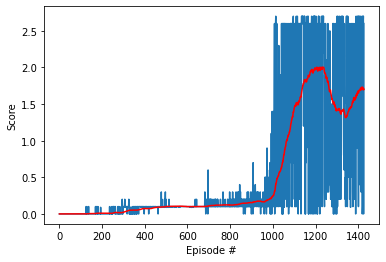
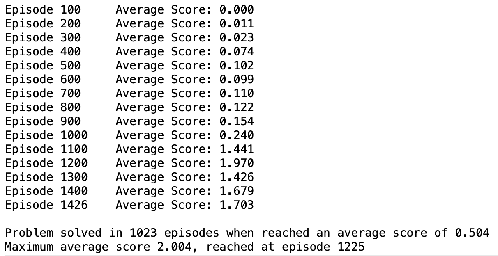

# Technical report on Project 3: Competition and Collaboration

## Introduction

This report introduces the details about how two smart agents have been designed and trained so that they can solve the task posed by the COMPETITION AND COLLABORATION project, namely: to teach every agent to play TENNIS. More specifically, every agent has to control a racket, bounce a ball over a net and not let the ball drop so that  **the goal of each agent is to keep the ball in play when comes from the other side of the court**.

## Learning algorithm
The smart agents are taught to optimally command their corresponding rackets following a Deep Reinforcement Learning approach.

Whereas Reinforcement Learning is a computational framework that addresses the problem of teaching an agent to select actions in a certain environment, with which it interacts, Deep Reinforcement Learning (DRL) can deal with the same problem in unknown, dynamic, complex and even stochastic environments. And this is the case of the TENNIS environment: it is a continuous space that every agent observes from its position through a number number of sensory inputs (8) and on which it has no prior knowledge. Moreover, TENNIS environment is a multi-agent domain that involves the participation of two agents.

The first approach one is tempted to use in a multi-agent environment is to rely on independently learning agents, each of them based on a DRL algorithm suitable for continuous state and action spaces as, for example, PPO or DDPG. However, as the [Multi-Agent Actor-Critic for Mixed Cooperative-Competitive Environments](https://arxiv.org/pdf/1706.02275.pdf) paper proves, naive policy gradient methods perform poorly in even simple multi-agent environments. Instead, the same paper proposes an alternative algorithm based on centralized critic with deterministic policies that is referred as *multi-agent deep deterministic policy gradient* (MADDPG). This is the underlining algorithm used to design the smart agents of this project.

The MADDPG accomplish its goal of training agents that interacts in a multi-agent environment by adopting a framework of centralized training with decentralized execution. This means the algorithm allows the policies to use extra information to ease training, so long as that information is not used at test time.

In practical terms, the MADDPG paper proposes a simple extension of DDPG algorithm where the critic is augmented with extra information about the policies of other agents. Thus, the action value function, which is calculated by the critic of the DDPG algorithm, is replaced by a centralized action-value function that takes as input the actions of all agents as well as the observation of all agents (or even some additional state information). One centralized action-value function is learned separately by every agent, which allows them to have individual rewards structures. This makes the algorithm suitable for application in cooperative, competitive or mixed environments. Furthermore, the MADDPG makes use of a common replay buffer that contains the tuple recording experience of all agents. For a detailed description of the MADDPG algorithm and its pseudocode, refer to the aforementioned paper.

In doing so, MADDPG overcomes a main limitation of single-agent DRL algorithms when face multi-agent environments, namely: the environment becomes non-stationary from the perspective of any individual agent since it evolves in a way that is not explainable by the changes in the agents's owns policy. Thus, setting the centralized action-value function makes the environment stationary.

Therefore, the smart agents used in this project are designed and training in accordance to Multi_Agent Deep Deterministic Policy Gradient (MADDPG) algorithm, which was first introduced by Google OpenAI and UC Berkeley researchers.

Likewise Actor-Critic algorithms, MADDPG uses two deep neural networks per every agent: one, the so-called actor, acts as a function approximation of the policy that maps state to action; the other, the critic, is the function approximation of the action-value function. The actor network is used to approximate the optimal policy deterministically; that means, it always outputs the best believed action for any given state. Therefore, the actor is basically learning the argmaxaQ(s, a), which is the best action. On the other hand, the critic learns to evaluate the optimal action-value function by using the actors best believed action.

Likewise DDPG, MADDPG employs **Fixed Targets** to avoid harmful correlations between the target and the parameters that change during the optimization (update a guess with a guess). This is, it uses two copies of the network weights for each network: a regular for the actor and a regular for the critic; and a target for the actor and a target for the critic. Then, the target networks are updated with the weight of the regular networks using a **soft update strategy**. It consists of slowly blending the regular network weights with the target network weights. For instance, for a blending factor (tau) of 0.01, the target network of both actor and critic networks will be made 99.99% of the target network weights and only 0.01% of the regular network weights.

Moreover fixed targets and soft update strategy, the MADDPG paper also employs the following techniques for addressing other specific challenges:
+ As in DDPG, **Replay Buffer** is used to break the correlation effects between consecutive experience tuples. Now, however, this replay buffer is common for all the agents and it is fed with the experiences of all of them.
+ **Noise** is added to the actor policy in order to push for exploration during the learning process.

All these techniques have been considered during the implementation of the algorithm herein described.

The smart agents are codified in Python-PyTorch code in the files `maddpg_agent.py` and `ddpg_agent.py`.

## Architecture of the neural network used as function approximation for Actor and Critic functions
At the heart of the Actor and Critic functions of every smart agent there are two deep neural network that act as function approximation of the policy function and the action-value function respectively. For the actor, the environment state is passed in and the function approximation produces an action vector. For the critic, the environment state and the action vector (output from the actor) are passed in and the function approximation produces the action-value for that state-action pair.

Both function approximations are represented by similar feedforward multilayer perceptron (MLP) neural network with the following features:
+ input layer: 24 nodes (one for every dimension of the state vector) for the actor and 48 nodes (because there are two agents) for the critic
+ two hidden layers, whose number of nodes are the hyperparameters fc1 and fc2 respectively, and leaky ReLu activation function applied at the output of each layer; note that, in terms of speed of the learning process, leaky ReLu activation function was proved to be slightly more efficient than ReLu one during the fine tuning of the algorithm
+ output layer: 2 nodes (one for every dimension of the action space) and a `tanh` activation function for the actor; and 1 node (the action-value) without any activation function for the critic.
+ for the actor network, the state vector is introduced in the first layer of the network
+ for the critic network, the state vector is introduced in the first layer of the network and then its output is concatenated with the action vector before being input in the second layer of the network

The architectures of the actor and critic function approximations are codified in Python-PyTorch code in the file `actor_critic_nets.py`.

## Chosen Hyperparameters
The final values of the considered hyperparameters are listed next.

+ Function approximator architecture for both actor and critic functions:
  + Nodes at hidden layer1 --> fc1 = 190
  + Nodes at hidden layer2 --> fc2 = 160

+ Learning process
  + Replay buffer size = 1e6
  + Minibatch size = 256
  + Discount factor (gamma) = 0.99
  + Target parameters soft update factor (TAU) = 0.005
  + Actor Learning rate = 0.0001
  + Critic Learning rate = 0.0005
  + Critic network L2 weight decay = 1e-6
  + Update the actor-critic networks every step
  + Number of learning passes at every update = 1
  + Episodes to span the epsilon decay = 800
  + Maximum time-steps per episode = until the end of the episode (done = True)

+ Ornstein-Uhlenbeck noise parameters:
  + Mu = 0
  + Sigma = 0.05
  + Theta = 0.10
  + A linearly-decay factor is applied to the noise; it starts at 1.00 and ends at 0.00 after 800 episodes

Those final values are the result of an heuristic approach. The starting point was the values fixed in my project 2, [Continuous Control](https://github.com/felixrlopezm/Udacity_Deep_Reinforcement_Learning/tree/main/P2-Continuous_Control), of the Udacity Deep Reinforcement Learning nanodegree, where I applied the DDGP algorithm to solve the task there posed. From there, the trials mainly focused on variation of: actor and critic learning rates; number of nodes of the network hidden layers (fc1, fc2); minibatch size; actor and critic learning rates; and application of noise decay.

I found quite challenging and time costing in finding a set of hyperparameters that worked. In my experience, the stability of the learning process of the MADDPG algorithm is very sensitive to relative small variations of the hyperparamenters, and in particular to:
+ the number of nodes in the hidden layers of the actor and critic networks
+ the soft update factor (tau)
+ the random scheme for the [Wiener factor](https://en.wikipedia.org/wiki/Ornstein–Uhlenbeck_process#Definition) in the Ornstein-Uhlenbeck process: the change from random numbers (as I did in the aforementioned project 2) to a standard normal distribution was a game-changer in the learning performance of the algorithm.

## Smart agent performance

With the learning algorithm chosen for the smart agents and the hyperparameters listed in the previous section, the typical learning process of the agents is shown in the figures below.

Figure 1: general view              |  Figure 2: last-100 average score
:----------------------------------:|:-------------------------:
!  | 

The log of the learning process shows that the algorithm takes its time to begin to learn but, it does it resolutely when it starts.

The **TENNIS environment can be considered solved at episode 1023**, when the average score of the winner agent of the last 100 episodes overpass the 0.5-point threshold. Then, the learning keeps on improving until it reaches a maximum average score of 2.004 at episode 1225. The learning process keeps that level for a very short time and then drops in the following episodes to begin to recover some episodes later. After 200 episodes without improving that maximum score, the learning process was forced to stop.

The weights of the neural networks of the actor and critic for every agent at the maximum-score episode are saved in the files `trained_actor_XX-ddpg.pth` and `trained_critic_XX-ddpg.pth`, where `XX` is the agent identification number . They can be used to feed the actor and critic networks of the trained agents.

## Ideas for future work
In my opinion, the smart agents built and trained with the MADDPG algorithm and tuned with the listed hyperparameters have little room for improvement as they are right now. Therefore, it is worth considering whether another type of Multi-Agent Reinforcement Learning (MARL) paradigm can outperforms MADDPG in the TENNIS task in terms of stability of the learning process, speed of the learning process or maximum score of the trained agent. In this regard, Sharma et al. proposes in [this recent paper](https://arxiv.org/pdf/2107.14316.pdf) a number of alternative algorithms based as well on centralized learning with decentralized execution (see their Table 1, where they summarizes a number of centralized MARL methods).

On the other hand, the code implementation herein shown has only considered some of the elements presented in the MADDPG paper but excluded others. One of those excluded is the possibility to remove the assumption of knowing other agents' policies for calculating the centralized action-value function of every agent. This assumption might be constraining when facing problems in which a perfect communication between agents is not feasible or realistic. Actually, the latter is the case in a competition scenario such as a real TENNIS game, in which a player can observe how the other plays and, therefore, try to infer its rival's policy but will never have access to the actual policy that the rival is using. However, this is exactly the assumption I have implicitly taken in the implementation herein shown. Therefore, a future work could explore how the training would perform if every agent does not have access to the policy of the other but has to infer it by means of function approximations as proposed in the [MADDGP paper](https://arxiv.org/pdf/1706.02275.pdf) (see its section 4.2).
